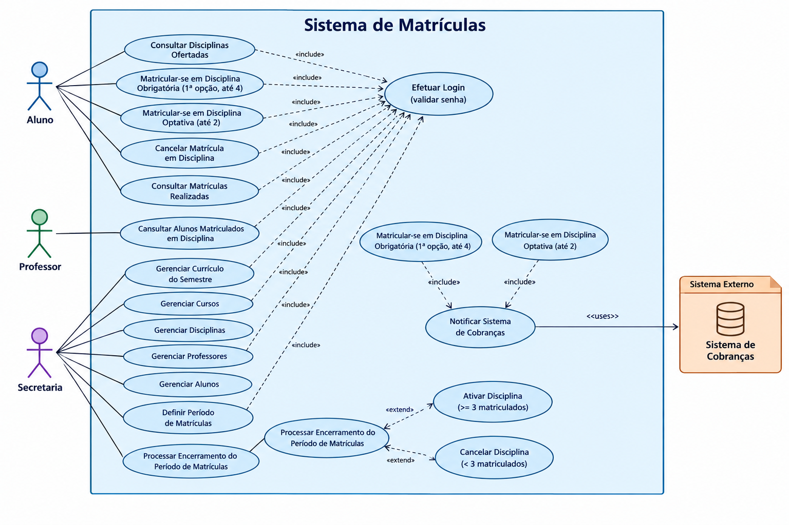

# Sistema de Matrículas

Sistema de informatização do processo de matrículas de uma universidade. A secretaria mantém o
currículo de cada semestre e as informações sobre cursos, disciplinas, professores e alunos; os
alunos se matriculam e cancelam matrículas em disciplinas durante os períodos de matrícula; e os
professores consultam quem está matriculado em suas disciplinas.

Projeto desenvolvido como trabalho da disciplina Laboratório de Desenvolvimento de Software.

## Regras de negócio principais

- Um aluno se matricula em até **4 disciplinas obrigatórias** (1ª opção) e até **2 disciplinas
  optativas** por semestre.
- Durante o período de matrículas, o aluno pode se matricular e também cancelar matrículas já feitas.
- Uma disciplina só fica **ativa** no semestre seguinte se, ao final do período de matrículas, tiver
  **pelo menos 3 alunos** matriculados; caso contrário, é **cancelada**.
- Uma disciplina tem no máximo **60 alunos**; ao atingir esse número, as matrículas para ela são
  encerradas automaticamente.
- Ao se matricular, o aluno gera uma notificação para o **Sistema de Cobranças**, que passa a cobrá-lo
  pelas disciplinas do semestre.
- Todo usuário (aluno, professor, secretaria) acessa o sistema mediante **login com senha**.

## Diagrama de Caso de Uso

Fonte editável (PlantUML): [`docs/caso-de-uso.puml`](docs/caso-de-uso.puml).

**Atores:** Aluno, Professor, Secretaria e Sistema de Cobranças (sistema externo, notificado após
uma matrícula).

## Histórias de Usuário

### Autenticação

**US01 — Login**
> Como usuário do sistema (aluno, professor ou secretaria), eu quero fazer login com minha senha,
> para que eu possa acessar as funcionalidades específicas do meu perfil.

- [ ] O sistema valida usuário e senha antes de liberar qualquer outra funcionalidade.
- [ ] Login inválido exibe mensagem de erro e não concede acesso.

### Aluno

**US02 — Consultar disciplinas ofertadas**
> Como aluno, eu quero consultar as disciplinas ofertadas no currículo do semestre, para que eu
> possa decidir em quais me matricular.

- [ ] A lista mostra apenas disciplinas do currículo do semestre corrente.
- [ ] Cada disciplina mostra se ainda há vagas (limite de 60 matriculados).

**US03 — Matricular-se em disciplina obrigatória**
> Como aluno, eu quero me matricular em disciplinas obrigatórias como 1ª opção, para que eu cumpra
> os créditos exigidos pelo meu curso no semestre.

- [ ] O aluno pode se matricular em até 4 disciplinas obrigatórias por semestre.
- [ ] A matrícula só é aceita se o período de matrículas estiver aberto.
- [ ] A matrícula só é aceita se a disciplina ainda não atingiu 60 alunos matriculados; ao atingir
      60, a disciplina para de aceitar novas matrículas.
- [ ] Ao confirmar a matrícula, o Sistema de Cobranças é notificado para cobrar o aluno pela
      disciplina naquele semestre.

**US04 — Matricular-se em disciplina optativa**
> Como aluno, eu quero me matricular em disciplinas optativas alternativas, para que eu tenha
> flexibilidade de escolha além das obrigatórias.

- [ ] O aluno pode se matricular em até 2 disciplinas optativas por semestre.
- [ ] Aplicam-se as mesmas regras de período aberto, limite de vagas e notificação de cobrança da
      matrícula obrigatória (US03).

**US05 — Cancelar matrícula em disciplina**
> Como aluno, eu quero cancelar uma matrícula feita anteriormente, para que eu possa corrigir minha
> escolha enquanto o período de matrículas estiver aberto.

- [ ] O cancelamento só é permitido durante o período de matrículas.
- [ ] Após o cancelamento, a vaga na disciplina volta a ficar disponível para outros alunos.

**US06 — Consultar matrículas realizadas**
> Como aluno, eu quero consultar quais disciplinas estou matriculado no semestre, para que eu possa
> acompanhar minha situação antes do fechamento do período.

- [ ] A consulta mostra todas as disciplinas (obrigatórias e optativas) em que o aluno está
      matriculado no semestre corrente.

### Professor

**US07 — Consultar alunos matriculados em disciplina**
> Como professor, eu quero consultar quais alunos estão matriculados em cada uma das minhas
> disciplinas, para que eu possa me preparar para o semestre letivo.

- [ ] A lista só mostra alunos de disciplinas lecionadas pelo professor autenticado.
- [ ] A lista reflete o estado mais recente de matrículas/cancelamentos.

### Secretaria

**US08 — Gerenciar currículo do semestre**
> Como funcionário da secretaria, eu quero montar o currículo de cada semestre, para que os cursos
> tenham uma grade de disciplinas ofertadas.

- [ ] É possível associar disciplinas existentes ao currículo de um semestre específico.

**US09 — Gerenciar cursos**
> Como funcionário da secretaria, eu quero cadastrar e manter os cursos (nome e número de
> créditos), para que os alunos possam ser vinculados a eles.

- [ ] Um curso tem nome, número de créditos e é composto por várias disciplinas.

**US10 — Gerenciar disciplinas**
> Como funcionário da secretaria, eu quero cadastrar e manter as disciplinas, para que elas possam
> compor o currículo e receber matrículas.

- [ ] É possível cadastrar, editar e remover disciplinas.

**US11 — Gerenciar professores**
> Como funcionário da secretaria, eu quero cadastrar e manter os professores e as disciplinas que
> lecionam, para que o vínculo professor-disciplina esteja correto no sistema.

- [ ] É possível associar um professor a uma ou mais disciplinas.

**US12 — Gerenciar alunos**
> Como funcionário da secretaria, eu quero cadastrar e manter os alunos, para que eles possam
> acessar o sistema e se matricular em disciplinas.

- [ ] Cada aluno cadastrado recebe login e senha para acesso ao sistema.

**US13 — Definir período de matrículas**
> Como funcionário da secretaria, eu quero abrir e encerrar o período de matrículas de um
> semestre, para que os alunos só possam se matricular/cancelar matrículas dentro da janela
> definida.

- [ ] Fora do período aberto, tentativas de matrícula ou cancelamento são recusadas.

**US14 — Processar encerramento do período de matrículas**
> Como sistema, eu quero verificar automaticamente, ao final do período de matrículas, quantos
> alunos estão matriculados em cada disciplina, para que apenas disciplinas viáveis ocorram no
> semestre seguinte.

- [ ] Disciplinas com 3 ou mais alunos matriculados são marcadas como ativas.
- [ ] Disciplinas com menos de 3 alunos matriculados são canceladas.

